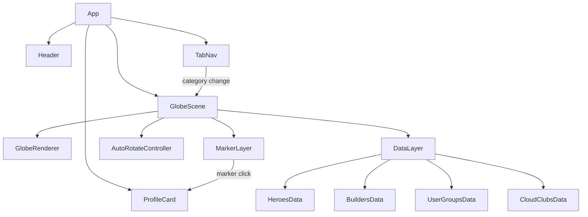

# Design Document: AWS Community Globe

## Overview

A single-page web application built with React and Three.js (via `react-globe.gl` or `three-globe`) that renders an interactive 3D globe visualizing AWS Builder community members. The app uses the AWS brand color palette and allows users to explore Heroes, Community Builders, User Groups, and Cloud Clubs via tab navigation. Clicking a location marker opens a profile card with member details.

The data layer uses static JSON files seeded with mock community data (with real geographic coordinates), since the AWS Builder community pages do not expose a public API. The architecture is designed so the data source can be swapped to a real API later.

---

## Architecture



**Tech Stack:**
- React 18 (Vite)
- `globe.gl` — WebGL globe with dot-matrix land rendering, marker support, and built-in drag/rotation
- Tailwind CSS — utility-first styling for AWS color palette
- Static JSON — community member data with lat/lng coordinates

---

## Components and Interfaces

### `App`
Root component. Manages active category state and profile card visibility.

```ts
interface AppState {
  activeCategory: 'heroes' | 'community-builders' | 'user-groups' | 'cloud-clubs';
  selectedMember: Member | null;
}
```

---

### `Header`
Top bar with AWS wordmark/logo and app title "AWS Community Globe".

---

### `TabNav`
Four tab buttons. Active tab highlighted with AWS Orange underline/background.

```ts
interface TabNavProps {
  activeCategory: CategoryKey;
  onChange: (category: CategoryKey) => void;
}
```

Tabs:
| Label | Key |
|---|---|
| Heroes | `heroes` |
| Community Builders | `community-builders` |
| User Groups | `user-groups` |
| Cloud Clubs | `cloud-clubs` |

---

### `GlobeScene`
Wraps the `globe.gl` instance. Handles:
- Rendering the dot-matrix globe
- Placing markers from the active category data
- Auto-rotation logic
- Forwarding marker click events

```ts
interface GlobeSceneProps {
  category: CategoryKey;
  onMarkerClick: (member: Member) => void;
}
```

Auto-rotation is implemented by incrementing the globe's `pointOfView` longitude on each animation frame. A 3-second idle timer resets on any pointer interaction.

---

### `MarkerLayer`
Handled internally by `globe.gl` via its `pointsData`, `pointLat`, `pointLng`, `pointColor`, and `pointRadius` props. Each category has a distinct marker color:

| Category | Marker Color |
|---|---|
| Heroes | `#FF9900` (AWS Orange) |
| Community Builders | `#1A9C3E` (Green) |
| User Groups | `#00A1C9` (AWS Blue) |
| Cloud Clubs | `#BF0816` (Red) |

---

### `ProfileCard`
Overlay card displayed on marker click. Dismisses on outside click or close button.

```ts
interface ProfileCardProps {
  member: Member | Member[];  // array for clusters
  onClose: () => void;
}
```

Card layout:
- Avatar image (circular, 64px)
- Member name (white, 18px bold)
- Category badge (AWS Orange pill)
- Location name (gray, 14px)
- Follow button (AWS Orange, outlined style)
- Close (×) button top-right

---

## Data Models

```ts
type CategoryKey = 'heroes' | 'community-builders' | 'user-groups' | 'cloud-clubs';

interface Member {
  id: string;
  name: string;
  avatarUrl: string;
  category: CategoryKey;
  location: string;       // human-readable city/country
  lat: number;            // geographic latitude
  lng: number;            // geographic longitude
  profileUrl?: string;
}

interface CategoryData {
  category: CategoryKey;
  members: Member[];
}
```

Data files live at `src/data/{category}.json`. Each file exports an array of `Member` objects.

---

## Error Handling

| Scenario | Behavior |
|---|---|
| Data file fails to load | Globe renders without markers; toast/banner: "Could not load community data." |
| Avatar image 404 | Fallback to a generic AWS-branded avatar placeholder SVG |
| Globe WebGL not supported | Render a static fallback message: "Your browser does not support WebGL." |
| Cluster click (multiple members at same lat/lng) | ProfileCard renders a scrollable list of member entries |

---

## Visual Design

### Color Tokens
```
Background:     #0F1923
Surface:        #1B2836
Border:         #2D3F50
Text Primary:   #FFFFFF
Text Secondary: #8B9BAA
AWS Orange:     #FF9900
AWS Blue:       #00A1C9
```

### Globe Style
- Land dots: `#2D3F50` (muted blue-gray)
- Globe atmosphere: subtle `#FF9900` glow at 0.1 opacity
- Background: `#0F1923`

### Tab Style
- Inactive: dark surface, white text, no border
- Active: AWS Orange bottom border (3px), white text, slightly lighter background

### Profile Card
- Background: `#1B2836`
- Border: 1px `#2D3F50`
- Border-radius: 12px
- Follow button: outlined, `#FF9900` border and text, fills orange on hover

---

## Testing Strategy

- Unit tests for data loading utilities (invalid JSON, missing fields)
- Unit tests for the idle-timer / auto-rotation logic (pure function)
- Component tests for `TabNav` (tab switching, active state)
- Component tests for `ProfileCard` (renders member data, close behavior, cluster list)
- Integration smoke test: globe renders without crashing with mock data for each category
