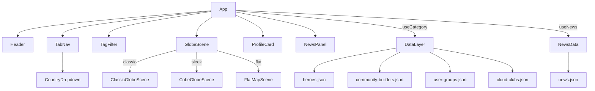

# Design Document: AWS Community Globe

## Overview

A single-page React + Vite application that renders an interactive 3D globe visualising the global AWS Builder community. Users can explore Heroes, Community Builders, User Groups, Cloud Clubs, and AWS news via tab navigation. Clicking a location marker opens a rich profile card. The app supports three globe styles, country/tag filtering, a news feed panel, dark/light mode, and social header links.

---

## Architecture



**Tech Stack:**
- React 18 + Vite
- `globe.gl` — WebGL classic globe
- `cobe` — lightweight WebGL sleek globe
- Leaflet / custom canvas — flat map scene
- Tailwind CSS — utility-first styling
- Static JSON — community data with lat/lng coordinates
- AWS RUM — real user monitoring

---

## Components

### `App`
Root component. Manages all global state.

```ts
interface AppState {
  activeCategory: CategoryKey;
  selectedMember: Member | Member[] | null;
  selectedNewsItems: NewsItem[];
  selectedTag: string | null;
  selectedCountry: string | null;
  darkMode: boolean;
  globeDesign: 'classic' | 'cobe' | 'flat';
  zoomCommand: { direction: 'in' | 'out' | null; nonce: number };
  newsPanelOpen: boolean;
  flyToOverride: { lat: number; lng: number; nonce: number } | null;
}
```

---

### `Header`
Top bar with AWS wordmark, app title, creator credit, and icon links.

Icon links (left to right): LinkedIn → AWS Builder article → Telegram → GitHub → Dark/Light toggle.

---

### `TabNav`
Tab bar with five tabs + country dropdown.

Tabs: Heroes | Community Builders | User Groups | Cloud Clubs | News

The `CountryDropdown` renders immediately after the Cloud Clubs tab, separated by a subtle divider. It is hidden when the News tab is active.

---

### `CountryDropdown`
Custom dropdown (not a native `<select>`) rendered via `ReactDOM.createPortal` on `document.body` to avoid overflow clipping. Positions itself using `getBoundingClientRect` on the trigger button.

Each option shows: flag emoji + country name + member count.

---

### `TagFilter`
Horizontal scrollable strip of tag pill buttons. Shown below the tab bar when the active category has tagged members. Hidden on the News tab.

---

### `GlobeScene` (lazy)
Switches between three globe implementations based on `globeDesign` prop:
- `ClassicGlobeScene` — `globe.gl` WebGL globe
- `CobeGlobeScene` — `cobe` lightweight globe
- `FlatMapScene` — 2D flat map

All three accept the same props interface:
```ts
interface GlobeSceneProps {
  category: CategoryKey;
  members: Member[];
  onMarkerClick: (member: Member | Member[]) => void;
  cardOpen: boolean;
  darkMode: boolean;
  flyToTarget: { lat: number; lng: number; nonce?: number } | null;
  zoomCommand: { direction: 'in' | 'out' | null; nonce: number };
}
```

---

### `ProfileCard`
Overlay card. Renders two views:

**SingleMemberView** — for Heroes, Community Builders, User Groups:
- Avatar (64px circular), name, category badge
- Heroes: hero type label (e.g. "Serverless Hero") + "View Profile" link
- Community Builders: specialisation tag
- Location with 📍 prefix
- Action button: "View Profile" / "Follow" / "Join"

**CloudClubSingleView** — for Cloud Clubs:
- Leader avatar stack (up to 2 overlapping avatars)
- Club name, leader name(s), location
- "Join" button inline

**ClusterListView** — when multiple members share a location:
- Scrollable list, each row: avatar, name, hero type / tag, location, action button

Dismisses on outside click or × button.

---

### `NewsPanel`
Slide-in panel (right side, `min(460px, 100vw)` wide). Shows latest and trending AWS Builder news.

Each card: article image/avatar, title, author, tags, publish date, likes, comments, "Locate" button.

Toggled by a floating button that repositions based on panel open state.

---

## Data Models

```ts
type CategoryKey = 'heroes' | 'community-builders' | 'user-groups' | 'cloud-clubs' | 'news';

interface Member {
  id: string;
  name: string;
  avatarUrl: string;           // normalised from image_url for heroes
  profileUrl: string;          // normalised from hero_page_url / joinUrl
  category: CategoryKey;
  location: string;
  lat: number;
  lng: number;
  tag: string;                 // hero_type for heroes, specialisation for builders
  heroType: string;            // heroes only
  builderType: string;         // community builders only
  specialization: string;      // community builders only
  ledBy: { name: string; imageUrl: string }[];  // cloud clubs only
}

interface NewsItem {
  id: string;
  title: string;
  description: string;
  url: string;
  imageUrl: string;
  authorName: string;
  authorAlias: string;
  authorAvatarUrl: string;
  location: string;
  lat: number;
  lng: number;
  tags: string[];
  publishedAt: string;
  likesCount: number;
  commentsCount: number;
}
```

---

## Data Normalisation (`useCategory`)

Heroes JSON uses different field names. `normalizeMembers()` maps them:

| Raw field | Normalised field |
|---|---|
| `image_url` | `avatarUrl` |
| `hero_page_url` | `profileUrl` |
| `hero_type` | `heroType` + `tag` |

All categories are cached in memory after first load. Switching tabs does not re-fetch.

---

## Country Flag Utility (`countryFlags.js`)

- Builds a `Map<normalizedName, ISO2Code>` by iterating all AA–ZZ codes via `Intl.DisplayNames`.
- `COUNTRY_ALIASES` handles edge cases (Bosnia, Hong Kong, Türkiye, etc.).
- `countryCodeToFlag(code)` converts ISO2 → regional indicator emoji pair.
- `getCountryCode(country)` returns the ISO2 code for a country name string.

---

## Visual Design

### Color Tokens
```
Background:     #0F1923
Surface:        #1B2836
Border:         #2D3F50
Text Primary:   #FFFFFF
Text Secondary: #8B9BAA
AWS Orange:     #FF9900
AWS Blue:       #00A1C9
AWS Red:        #BF0816
```

### Globe Styles
- Classic: land dots `#2D3F50`, atmosphere glow `#FF9900` at low opacity
- Sleek (cobe): minimal, dark background
- Flat: 2D canvas/Leaflet map

### Marker Colors
| Category | Color |
|---|---|
| Heroes | `#FF9900` |
| Community Builders | `#1A9C3E` |
| User Groups | `#00A1C9` |
| Cloud Clubs | `#BF0816` |
| News | `#A78BFA` |

### Profile Card
- Backdrop blur, semi-transparent dark/light surface
- AWS Orange accents on badges, borders, hover states
- 12px border-radius, 60px box-shadow

---

## Error Handling

| Scenario | Behaviour |
|---|---|
| Data file fails to load | Error banner above globe; empty marker set |
| Avatar image 404 | `onError` hides the `` element |
| Members with lat/lng = 0,0 | Excluded from filtered members |
| Globe WebGL not supported | Fallback loading state shown |
