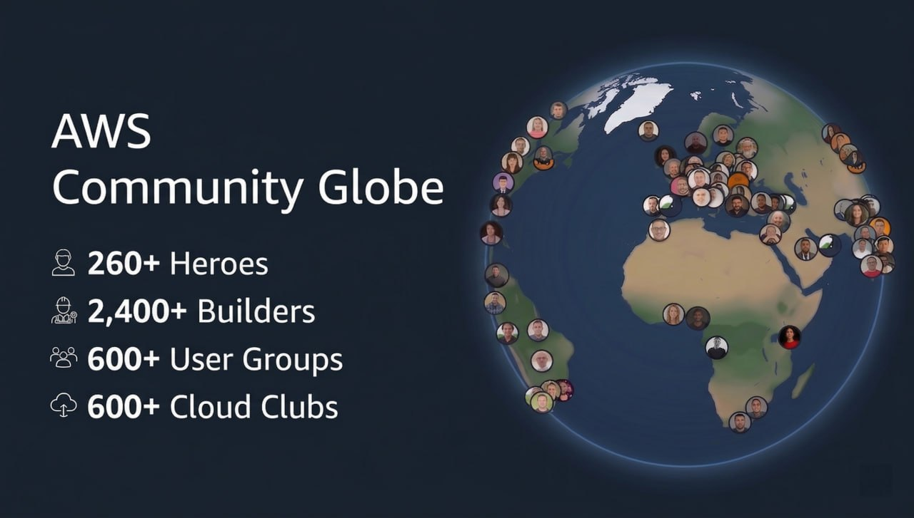

# AWS Globe has reached Version 1.0

AWS Globe has officially reached **Version 1.0**.

What started as a way to see the global AWS community on one map has grown into an interactive home for discovering people, groups, events, stories, and experiments from around the world.

## What is included in Version 1.0

### Three globe experiences

- **Community Globe** for people and groups.
- **Event Globe** for events and AWS Builder Center stories.
- **Experimental Globe**, a playground for new ideas and surprise features.

### The global AWS community in one place

- AWS Heroes.
- AWS Community Builders.
- AWS User Groups.
- AWS Student Builder Groups.
- Kiro Ambassadors.
- Kiro Events.
- AWS Community Days.
- Latest and trending AWS Builder Center news.

The Version 1.0 data snapshot represents more than **4,700 community records**, including 252 Heroes, 3,037 Community Builders, 575 User Groups, 896 Student Builder Groups, 38 Community Days, and 8 Kiro Events.

### Six ways to explore

- **Earth** for a detailed photorealistic globe.
- **Atlas** for Mapbox-powered vector geography.
- **Minimal** for a lightweight globe that works well on phones.
- **Map** for familiar two-dimensional exploration.
- **Gallery** for visual profile browsing.
- **Directory** for fast searching and scanning without a globe.

### Better discovery and interaction

- Region, country, and specialty filters.
- Near Me location navigation.
- Shareable URLs that preserve the selected tab, filters, view, and theme.
- Profile cards with community roles, leaders, social links, and public profiles.
- Event registration and official-site links.
- Merged portrait clusters that separate as visitors zoom closer.
- Program-specific fallback artwork when a profile image is unavailable.
- A Singapore 3D spotlight for Student Builder Groups.
- A dedicated AWS Community Day Singapore agenda, venue, map, and session-planning experience.

### Mobile and performance work

- A thumb-friendly bottom navigation dock on phones.
- Phone layouts tested at 360 px and 390 px widths.
- A lightweight default renderer for mobile devices.
- Pinch-to-zoom support with simplified mobile controls.
- Responsive filters and horizontally scrollable categories.
- WebGL cleanup that releases GPU resources when globes are replaced.
- A lighter mobile splash experience that avoids loading unnecessary datasets.
- Graceful fallback to a flat world map when WebGL is unavailable.

### Built for continued updates

- Automated daily Builder Center news refreshes.
- Scripts for community directory, profile, event, geocoding, and summary updates.
- Vercel Analytics and Speed Insights.
- An open-source repository for corrections, accessibility improvements, and new ideas.

## Launch post

**AWS Globe has reached Version 1.0.**

Explore more than 4,700 AWS community records across Heroes, Community Builders, User Groups, Student Builder Groups, Kiro events, Community Days, and Builder Center stories—all through one interactive world.

Version 1.0 introduces six ways to explore, smarter profile clustering, regional filters, shareable views, a dedicated Event Globe, a mobile bottom navigation experience, and an Experimental Globe where new and unexpected ideas can take shape.

The community, connected.

[Explore AWS Globe](https://awscommunityglobe.click/) · [View the source on GitHub](https://github.com/Jagatees/aws-community-world)
